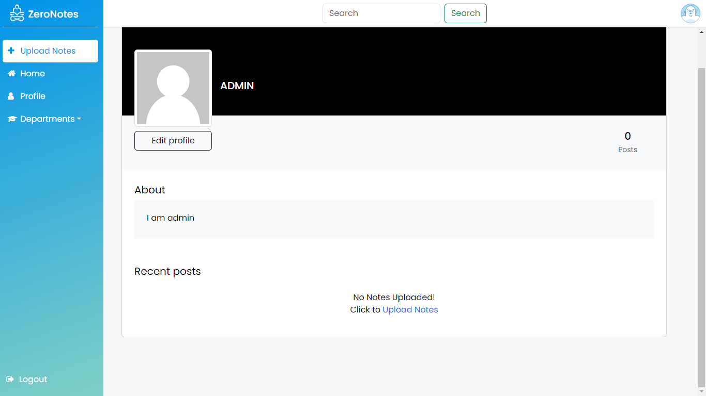

# ZeroNotes

Notes Sharing Web Application


## 🚀 Demo

[ZeroNotes](https://zeronotes.pythonanywhere.com)
## 💻 Run Locally

Clone the project

```bash
  git clone https://github.com/JKaliraj/ZeroNotes.git
```

Go to the project directory

```bash
  cd ZeroNotes/
```

Install dependencies

```bash
  pip install -r requirements.txt
```

Start the server

```bash
  python manage.py runserver
```


## 📷 Screenshots





## Tech Stack


## Deployment

To deploy this project refer 
[django-on-pythonanywhere](https://zappycode.com/tutorials/deploy-django-project-on-pythonanywhere)


## Support

For support, email mailtozerosoft@gmail.com


